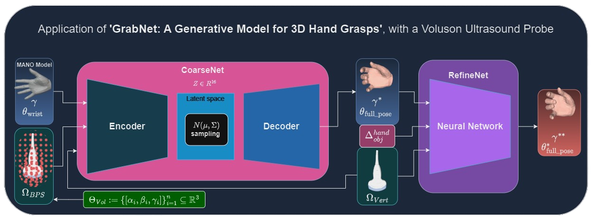

# Grasp Generation module
### The grasp generation module is based on GrabNet


[](https://arxiv.org/abs/2008.11200)




The grasp generation method is based on [GrabNet](http://grab.is.tue.mpg.de), a generative machine learning model for 3D hand pose and shape estimation. 
GrabNet is able to estimate realistic hand poses and shapes during grasp-based interaction with objects and consists of a sequence of two models: 1.) CoarseNet and 2.) RefineNet:
- **CoarseNet** is a conditional variational autoencoder (cVAE) that generates an initial grasp based on a [MANO](https://mano.is.tue.mpg.de) hand model and a mesh representation of 3D object to be grasped. 
- **RefineNet**: After the initial CoarseNet-based grasp pose estimation the grasp gets further refined by a neural network called 'RefineNet' that uses the initial grasp poses in addition to distances between the MAANO hand vertices and the object mesh. 


It is trained on a subset (right hand and object only) of [GRAB](http://grab.is.tue.mpg.de) dataset.
For more details please refer to the [Paper](http://grab.is.tue.mpg.de//uploads/ckeditor/attachments/363/grab_eccv2020.pdf) or the [project website](http://grab.is.tue.mpg.de).


## Getting started
#### CoarseNet and RefineNet models
- Download the GrabNet models from the [GRAB website](https://grab.is.tue.mpg.de), and move the model files to the models folder as described below.
```bash
    GrabNet
        ├── grabnet
        │    │
        │    ├── models
        │    │     └── coarsenet.pt
        │    │     └── refinenet.pt
        │    │     │
```

## Examples
Firstly go to the grasp_generation folder:
  ```Shell
  cd grasp_generation
  ```
- #### Generate grasps for input objects(.ply.,.obj, .stl files etc.)
Change the scale (optional argument --scale) accordingly. The default scale is 1, which means the input object is in m scale. Change it to 1000 if your input is in mm.
We've provided the Voluson ultrasound probe mesh namend 'voluson_ultrasound_probe.ply' which is used to generate plausible right hand grasps:

  ```Shell
python ./grabnet/tests/grab_new_tools.py --obj-path /root/POV_Surgery/assets/ultrasound_probe_models/voluson_ultrasound_probe.ply --rhm-path ../data/bodymodel/mano/MANO_RIGHT.pkl
   ```
The 'grab_new_tools.py' script generates initial hand grasps using GrabNet whose grasp information is stored in the following files:
```bash
    GrabNet
        ├── grabnet
        │    │
        │    ├── OUT
        │    │     └── generate.mat
        │    │     └── meshes.pt
```
The original POV-Surgery grasp generation and rendering pipeline contains subsequent steps in which generate.mat and meshes.pt will be required. In our proposed method, we focus on the initial grasp generation step only in order to generate a generate.mat file, which will serve as an input to our grasp rendering pipeline: [HUP-3D renderer](https://github.com/manuelbirlo/HUP-3D_renderer). However, we also generate meshes of the Hand, the object and combined hand grasp meshes (.ply files) in the grab_new_tools.py script that are stored in the ./OUT/generated_hand_grasp_meshes folder and look as follows:
```bash
    GrabNet
        ├── grabnet
        │    │
        │    ├── OUT
        │    │     │
        │    │     ├── generated_hand_grasp_meshes
                                                 └── 000000_Combined.ply
                                                 └── 000000_Hand.ply
                                                 └── 000000_Object.ply
                                                 └── 000001_Combined.ply
                                                 └── 000001_Hand.ply
                                                 └── 000001_Object.ply
                                                       .
                                                       .

```
You can view the generated meshes for example with [MeshLab](https://www.meshlab.net/) by simply importing all generated *_Combined.ply meshes into MeshLab's graphical user interface. You will notice that some of the generated grasps are not plausible due to hand-object interpeneratration. Simply note down the identification numbers of your desired plausbile grasps. You will need these grasp indices when you render your desired grasps using the [HUP-3D renderer](https://github.com/manuelbirlo/HUP-3D_renderer).

- #### Export diverse samples and select desired grasps
change the input accordingly depending the .pt file generated above.
```Shell
python ./grabnet/tests/export_meshes.py 
```
That should generate a folder named "test_meshes" in the 'OUT' directory. The folder contains the generated grasps in .ply format. We suggest using Meshlab to visualize the grasps and to select desired outputs. And note down the id of the desired grasps.
    
- #### Resampling near desired state
change the 'wanted_id' list accordingly. For example, if you want to resample the 1st and 3rd grasp in the test_meshes folder, change the 'wanted_id' to [1,3]. The resampled grasps will be saved in the 'OUT' folder.
 
```Shell
python ./grabnet/tests/subsampling.py   --obj-path /home/ray/Downloads/disk_recon_handle.ply\
        --rhm-path  ../data/bodymodel/mano/MANO_RIGHT.pkl
```

## License
Software Copyright License for **non-commercial scientific research purposes**.
Please read carefully the terms and conditions in the [LICENSE file](https://github.com/otaheri/GRAB/blob/master/LICENSE) and any accompanying documentation
before you download and/or use the GRAB data, model and software, (the "Data & Software"),
including 3D meshes (body and objects), images, videos, textures, software, scripts, and animations.
By downloading and/or using the Data & Software (including downloading,
cloning, installing, and any other use of the corresponding github repository),
you acknowledge that you have read these terms and conditions, understand them,
and agree to be bound by them. If you do not agree with these terms and conditions,
you must not download and/or use the Data & Software. Any infringement of the terms of
this agreement will automatically terminate your rights under this [License](./LICENSE).


